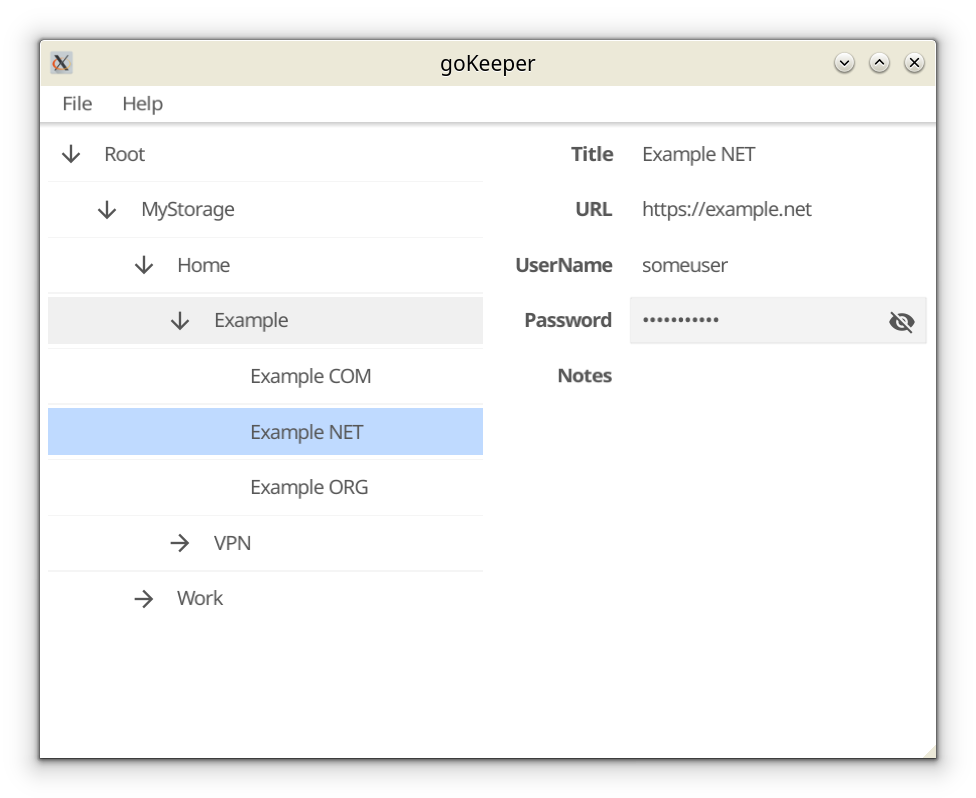

# goKeeperViewer #

## Description ##
Simple viewer for KDBX-files. It's support only basic features and 
don't support extended features like saved binaries.

## Build ##
First install fyne:
``go install fyne.io/fyne/v2/cmd/fyne``

Then build app:
``fyne build``

## Windows on Arm64 issues ##
On arm64 devices with windows you need "OpenCL and OpenGL Compatibility pack":

* Store link: [ms-windows-store://pdp/?productid=9NQPSL29BFFF](ms-windows-store://pdp/?productid=9NQPSL29BFFF)
* Web link: [https://apps.microsoft.com/store/detail/9NQPSL29BFFF](https://apps.microsoft.com/store/detail/9NQPSL29BFFF)

