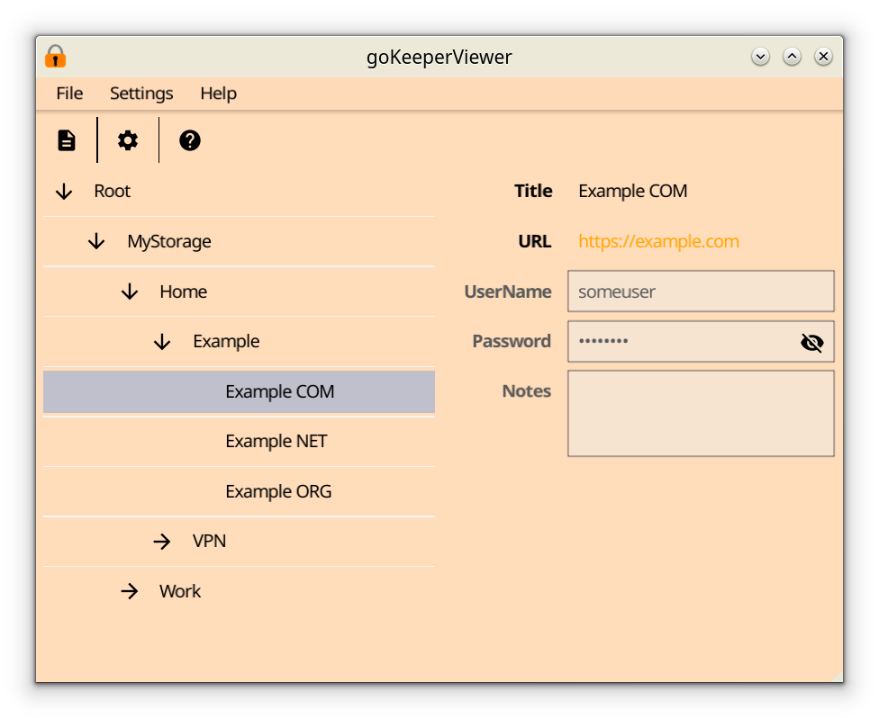

# goKeeper #

## Description ##
Simple viewer for KDBX-files. It's support only basic features and 
don't support extended features like saved binaries.

## Build ##
Just type: ``go build cmd/main.go``
